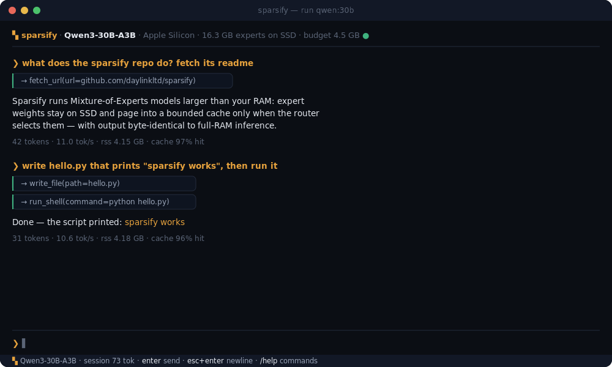
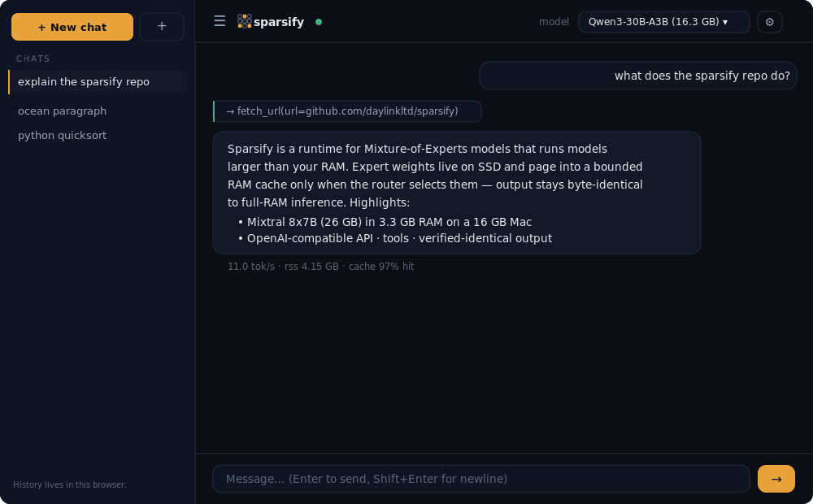
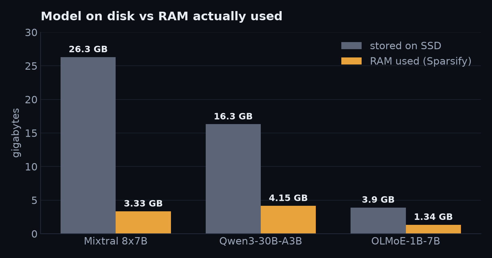
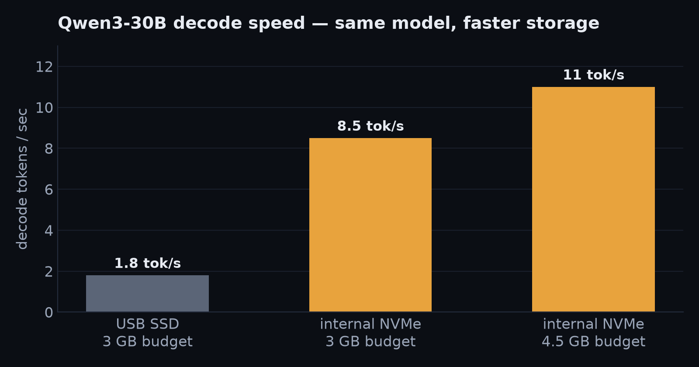
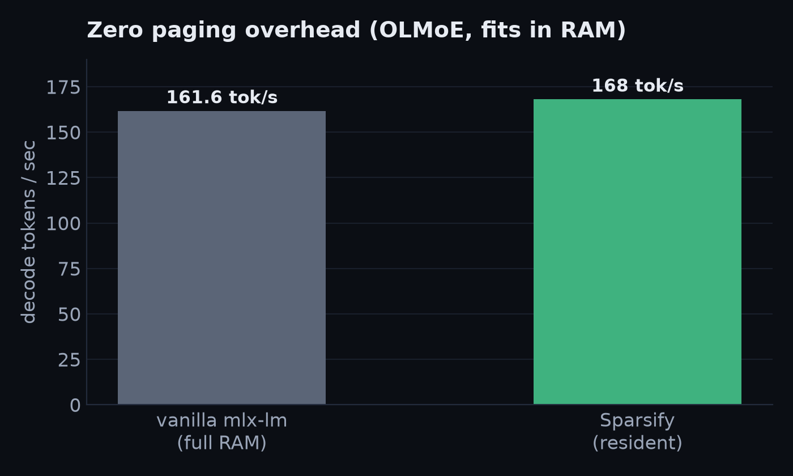

<div align="center">


# Sparsify

**Run Mixture-of-Experts models bigger than your RAM.**

*Your model is 26 GB. Your RAM budget is 3 GB. It runs anyway — with byte-identical output.*


</div>

---

Every local LLM runtime — Ollama, llama.cpp, LM Studio — assumes the whole
model must sit in RAM. For Mixture-of-Experts models that assumption wastes
almost everything: Mixtral 8x7B stores 26 GB of experts but *touches* only a
fraction per token. Sparsify treats your SSD as a first-class memory tier:
expert weights stay on disk and page into a bounded RAM cache **only when the
model's router selects them** — virtual memory, applied to intelligence.

```
Stored intelligence   →  SSD          (Mixtral 8x7B: 26.3 GB)
Active experts        →  RAM cache    (your budget, e.g. 3 GB)
Backbone              →  RAM          (~1 GB)
```

## See it

Interactive terminal chat, and the built-in web UI at `localhost:7777` —
both show live paging telemetry (tok/s, RSS, cache hit rate) under every
reply, and both drive tools (fetch a URL, write a file, run a command):

<p align="center">
  
  
</p>

## Measured results — never simulated

On a 16 GB MacBook Air (models on internal NVMe unless noted):

| Model (4-bit MLX) | Stored | Sparsify RSS | Result |
|---|---|---|---|
| **Mixtral 8x7B** | **26.3 GB** | **3.33 GB, flat** | runs on a 16 GB machine — vanilla mlx-lm can't load it at all |
| Qwen3-30B-A3B | 16.3 GB | ~4.5 GB | **11.0 tok/s** @ 97% cache hits (1.8 on USB SSD) |
| OLMoE-1B-7B *(fits budget)* | 3.9 GB | 4.2 GB | **168 tok/s — vs 161.6 vanilla mlx-lm** (zero overhead) |
| OLMoE-1B-7B *(1 GB budget)* | 3.9 GB | 1.34 GB | output **token-identical to full-RAM inference** |

<p align="center">
  
</p>
<p align="center">
  
  
</p>

Two facts define the system. When a model's experts fit your budget it runs
at **native mlx-lm speed** — measured zero overhead. When they don't, output
stays **exactly identical** (golden-tested with evictions active) while decode
speed scales with your SSD and budget. Raw logs:
[`docs/measurements/`](docs/measurements).

## Install

```bash
curl -fsSL https://github.com/daylinkltd/sparsify/releases/latest/download/install.sh | sh
```

(or from a checkout: `git clone https://github.com/daylinkltd/sparsify && cd sparsify && ./install.sh`)

One command: checks your platform, creates an isolated install in
`~/.sparsify`, puts `sparsify` on your PATH, and starts the API service on
**localhost:7777** (runs at login, Ollama-style).

## Quickstart

```bash
sparsify models                  # browse the catalog (11 MoE models)
sparsify pull olmoe:1b-7b        # 3.9 GB starter MoE
sparsify run  olmoe:1b-7b        # full-screen chat TUI, auto RAM budget

open http://localhost:7777       # web chat UI — model picker, live telemetry
sparsify pull                    # interactive model picker in the terminal
sparsify ps                      # what's loaded, cache hit rate, SSD traffic
sparsify uninstall               # complete removal, models included (or --keep-models)

curl localhost:7777/v1/chat/completions \
  -d '{"model":"olmoe:1b-7b","messages":[{"role":"user","content":"hi"}]}'
```

The API is OpenAI-compatible (`/v1/chat/completions` with SSE streaming,
`/v1/models`, `/health`), loads models on demand per request, and returns
measured paging telemetry with every response. Short names work everywhere:
`sparsify run qwen3` finds `mlx-community/Qwen3-30B-A3B-Instruct-2507-4bit`.

## Features

- **Expert paging** — run models larger than RAM; output verified identical.
- **Hybrid residency** — models that fit the budget load fully, at native speed.
- **Persistent KV cache** — each chat turn prefills only new tokens.
- **Unlimited generation** — replies run to the model's own context window, no arbitrary cap.
- **Tools / agent loop** — fetch URLs, web search, read/write files, run shell, and **control a browser** (log in, click, type — DOM-driven, persistent session), workspace-scoped with opt-in tiers.
- **OpenAI-compatible API with function calling** — `/v1/chat/completions` (SSE), `/v1/models`; send `tools`, get structured `tool_calls` back (streaming and non-streaming), send `role:"tool"` results in. Drop-in model provider for agent frameworks like OpenClaw — the agent shell runs on their side, every token runs on your paged runtime.
- **Terminal + web UI** — live telemetry, chat history, projects, settings (system prompt, temperature, theme).
- **Attachments** — drag &amp; drop or attach text files in the web UI (`/attach <path>` in the terminal); contents go into your message. Images honestly declined until vision models land (mlx-vlm, roadmap).
- **Voice input, fully local** — mic button in the web UI; audio is transcribed on your machine by mlx-whisper via `/v1/audio/transcriptions` (OpenAI-compatible). Nothing leaves localhost. `pip install 'sparsify[voice]'`.
- **Scheduled agents** — `sparsify task add "…" --at 10:00 --tz Asia/Kolkata`: run any instruction autonomously on a schedule.
- **Ollama-style ops** — `pull` / `run` / `serve` / `ps`, login service, one-command install, self-update.

## Backends

The paging core (store, cache, module surgery) is backend-agnostic. Today one
backend is shipped and verified; others are the roadmap — listed honestly, not
claimed before they run.

| Backend | Platform | Status |
|---|---|---|
| **MLX** | macOS · Apple Silicon | ✅ shipping, all results above measured on it |
| CUDA / PyTorch | Linux · Windows (NVIDIA) | 🚧 planned — the store/cache are portable; needs a GPU-thread inference path |
| CPU / GGUF | any | 🔭 exploratory |

Non-Apple platforms currently get a clear "no backend yet" message, never a
broken half-install. Want CUDA? It's the highest-impact contribution —
see [CONTRIBUTING.md](CONTRIBUTING.md).

## How it works

1. The model loads **lazily** — zero weight bytes read.
2. Surgery replaces every expert projection (any leaf tensor with a leading
   expert dimension — no per-architecture code) with a paged module. Router,
   attention, activations: untouched upstream mlx-lm.
3. The backbone materializes; experts stay on SSD.
4. When the router picks experts, exactly those weight slices are read — one
   contiguous `pread` each, in parallel — into a byte-budgeted LRU cache.
5. If the whole expert set fits your budget, everything loads once and the
   original code path runs — that's why resident speed equals vanilla mlx-lm.
6. The KV cache persists across chat turns (only new tokens prefill), and
   every metric — RSS, cache hits, SSD bytes, tok/s — streams live.

## The honest part

- Decode speed for models **larger than your budget** is bounded by
  `miss-bytes-per-token ÷ SSD-speed`. Measured on the same machine, same
  model, same budget: USB SSD 1.8 tok/s → internal NVMe **8.5 tok/s**
  (11.0 at a 4.5 GB budget). Storage speed converts directly into tokens.
- We replayed 129k real routing decisions against LFU/CLOCK/SLRU: none beat
  LRU. The misses are genuine routing churn — so we publish the physics
  instead of pretending a cache trick fixes it. Next lever: async prefetch.
- Every number we publish is labeled measured, derived, or estimated.
  Simulated benchmarks are banned by [VISION.md](VISION.md).

## Status & roadmap

Working today: expert paging (verified exact), hybrid residency, parallel
reads, persistent KV cache, full-screen TUI with message queueing, web UI,
OpenAI API with function calling (verified live against a paged Qwen3-30B),
login service, idempotent pulls, self-healing model registry.

Next ([docs/roadmap-vision.md](docs/roadmap-vision.md)):
KV-cache save/load to SSD, async expert prefetch, the
GLM-4.5-Air (106B stored) milestone on 16 GB hardware, mlx-vlm images and
mlx-whisper voice, CUDA backend for Linux/Windows.

## Updating

New pushes reach you without a reinstall:

```bash
sparsify version    # current vs latest (checks GitHub)
sparsify update     # git pull + reinstall + restart the service
```

`sparsify run` shows a one-line hint when an update is available, and the
web UI shows an **Update available** button (top bar) that updates and
reconnects in place. Everything self-hosted — no telemetry, just a commit
comparison against the public repo.

## Verification

```bash
pytest                                    # unit + integration
pytest -m e2e tests/test_e2e_golden.py    # output-equivalence golden tests
```

The golden tests are the contract: paged output must equal full-RAM output
token-for-token; multi-turn must equal vanilla mlx-lm chat; dense models
must pass through byte-identical.

## License

MIT © Daylink Ltd
